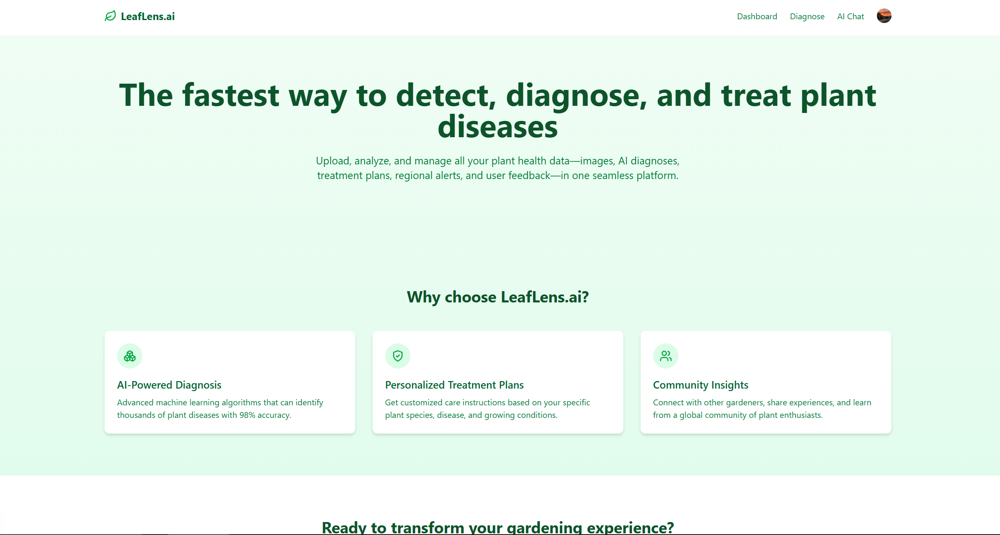
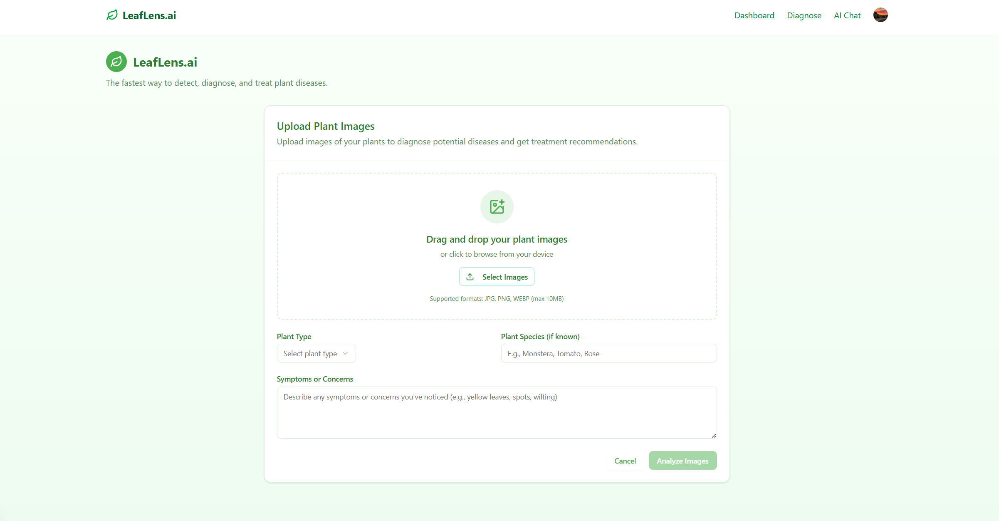
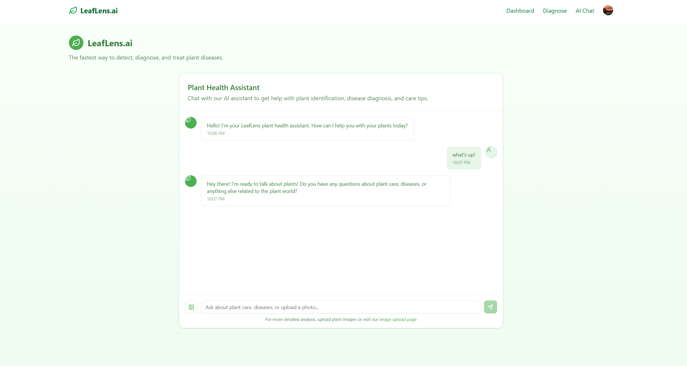
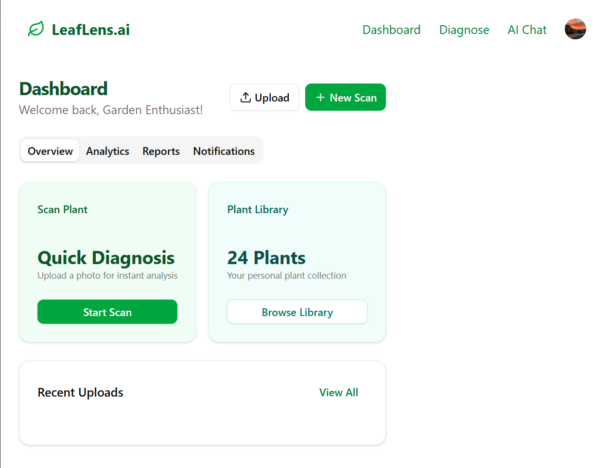
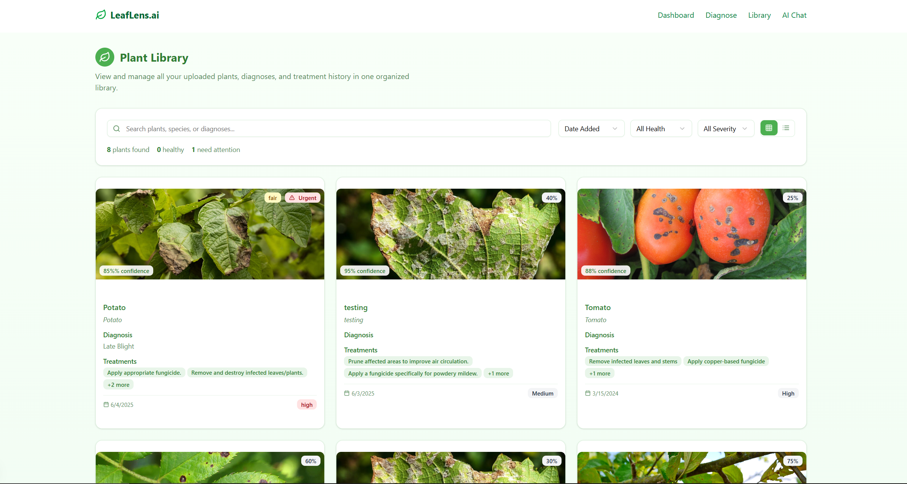

# Doctor Plant: AI-powered Plant Disease Diagnostics Tool

Doctor Plant is an intelligent application that helps users diagnose plant diseases and get treatment recommendations using AI technology. The application analyzes plant images and provides detailed insights about plant health, detected diseases, and recommended treatments.



## 🌟 Features

- **AI-Powered Disease Detection**: Upload plant images to get instant disease diagnosis
- **Detailed Analysis**: Receive comprehensive reports including:
  - Disease identification
  - Confidence level
  - Severity assessment
  - Plant health percentage
  - Treatment recommendations



- **Conversational AI**: Ask questions regarding plant care and get answers



- **User Dashboard**: View all the app's features



- **Plant Library**: View all past plant uploads, diagnoses, treatment plans, etc. Instantly updated and maintained via a Next.js API route that calls a lowdb-based custom database adapter written in TypeScript.




- **Image Processing**: Automatic image compression and optimization
- **User Authentication**: Secure user management with Clerk
- **Modern UI**: Beautiful and responsive interface built with Next.js, Tailwind CSS, and shadcn/ui
- **Dark Mode Support**: Seamless light/dark theme switching

## 🛠️ Tech Stack

### Frontend
- **Framework**: Next.js 15.3.1
- **Language**: TypeScript
- **UI Components**: 
  - Radix UI
  - Tailwind CSS
  - shadcn/ui
- **Authentication**: Clerk
- **Icons**: Lucide React

### Backend Services
1. **Image Processing Service**
   - Express.js
   - Sharp for image compression
   - Multer for file handling
   - CORS support

2. **Analysis Service**
   - Flask (Python)
   - Google AI/Generative Language
   - OpenAI integration
   - Image analysis capabilities

3. **Local JSON Database**
   - Next.js API Routing
   - lowdb local JSON storage
## 🚀 Getting Started

### Prerequisites
- Node.js (Latest LTS version)
- Python 3.x
- npm or yarn

### Installation

1. Clone the repository:
```bash
git clone https://github.com/yourusername/doctor-plant.git
cd doctor-plant
```

2. Install frontend dependencies:
```bash
npm install
# or
yarn install
```

3. Set up environment variables:
Create a `.env` file in the root directory with the following variables:
```env
# Frontend
NEXT_PUBLIC_CLERK_PUBLISHABLE_KEY=your_clerk_key
CLERK_SECRET_KEY=your_clerk_secret

# Image Processing Service
SERVER_PORT=3000

# Analysis Service
FLASK_APP=app.py
FLASK_ENV=development
```

4. Start the development servers:

Frontend:
```bash
npm run dev
# or
yarn dev
```

Image Processing Service:
```bash
cd services/img_compress
npm install
npm start
```

Analysis Service:
```bash
cd services/api
pip install -r requirements.txt
flask run
```

## 📝 API Documentation

### Image Processing Service
- **Endpoint**: `POST /compress`
- **Content-Type**: `multipart/form-data`
- **Max File Size**: 5MB
- **Supported Formats**: JPG, PNG

### Analysis Service
- **Endpoint**: `POST /analyze`
- **Content-Type**: `multipart/form-data`
- **Required Fields**: 
  - `image`: Plant image file
  - `prompt`: Analysis context

## 🤝 Contributing

Contributions are welcome! Please feel free to submit a Pull Request.