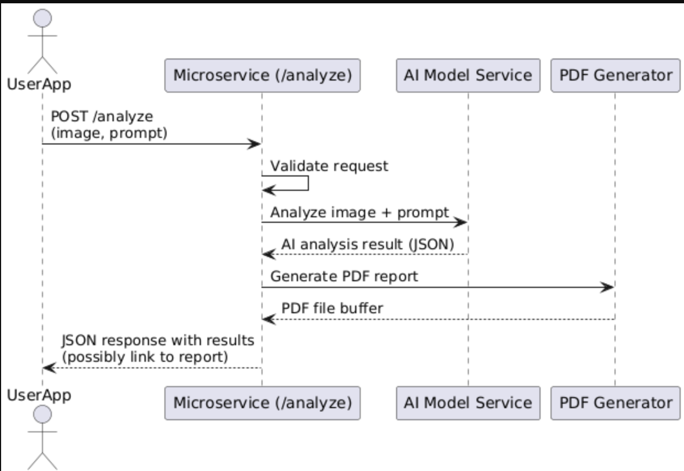

This document defines the fixed communication contract for interacting with the /analyze microservice endpoint I implemented. 

## How to Programmatically Request Data

To request an analysis from the microservice, send a `POST` request to:
http://localhost:5050/analyze

### Required Request Format

- **Method**: `POST`
- **Content-Type**: `multipart/form-data`
- **Form fields**:
  - `image`: A JPEG or PNG image of the plant (required)
  - `prompt`: A string containing a description or context (required)
 
An example request: 
```python
import requests
import io

files = {
    'image': ('plant.jpg', image_data, 'image/jpeg')
}
data = {
    'prompt': 'Test analysis of plant health'
}

response = requests.post("http://localhost:5050/analyze", files=files, data=data)
print(response.json())
```

## How to Programmatically Receive Data
Once your `POST` request is sent to the microservice, it will return a **JSON** response containing the analysis.

### Expected JSON Response Format
```json
{
  "disease_detected": "Powdery Mildew",
  "confidence": "93%",
  "severity": "Moderate",
  "recommendations": [
    "Trim infected areas",
    "Apply organic fungicide"
  ],
  "plant_health": "65%"
}
```

Example code to recieve and use the data:
```python
response = requests.post(url, files=files, data=data)

if response.status_code == 200:
    result = response.json()
    print("Disease:", result['disease_detected'])
    print("Confidence:", result['confidence'])
    print("Severity:", result['severity'])
    print("Recommendations:", result['recommendations'])
    print("Health:", result['plant_health'])
else:
    print("Error:", response.status_code)
```
    

